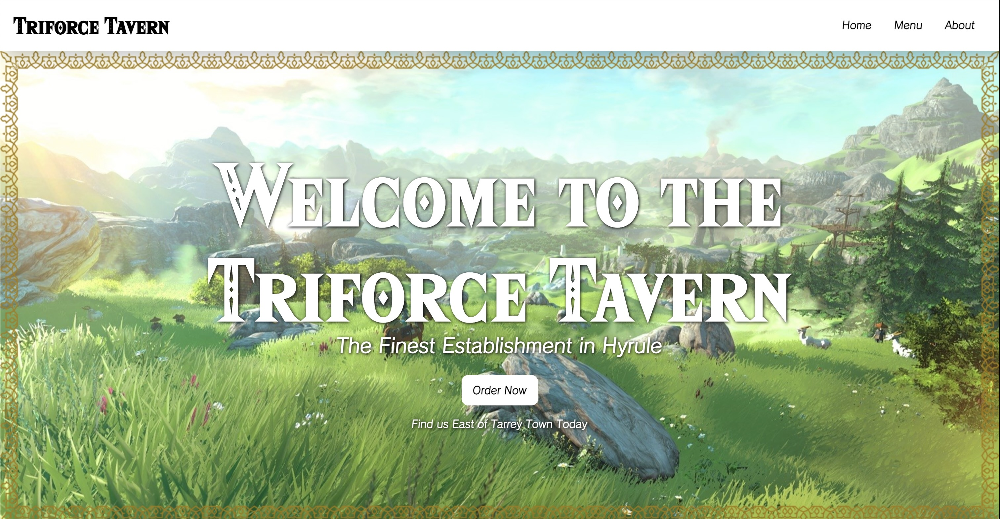
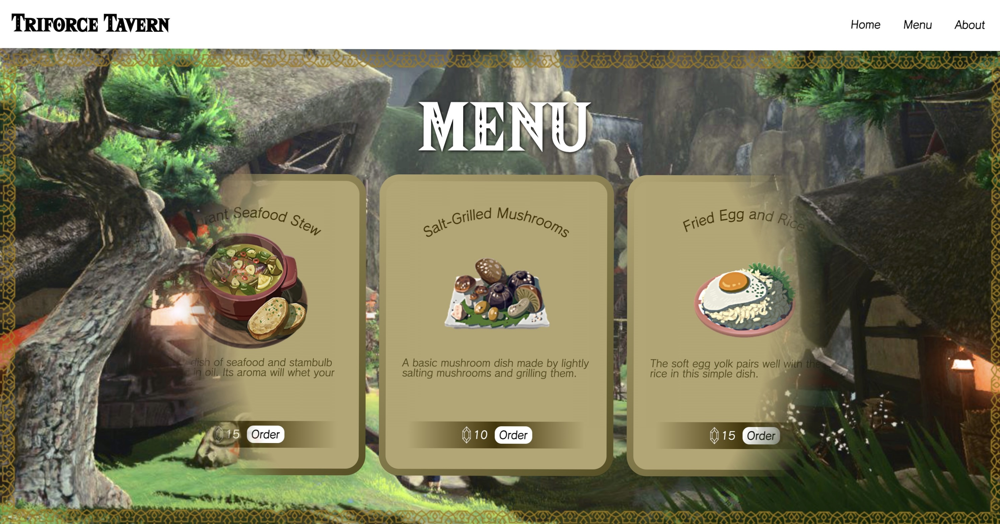
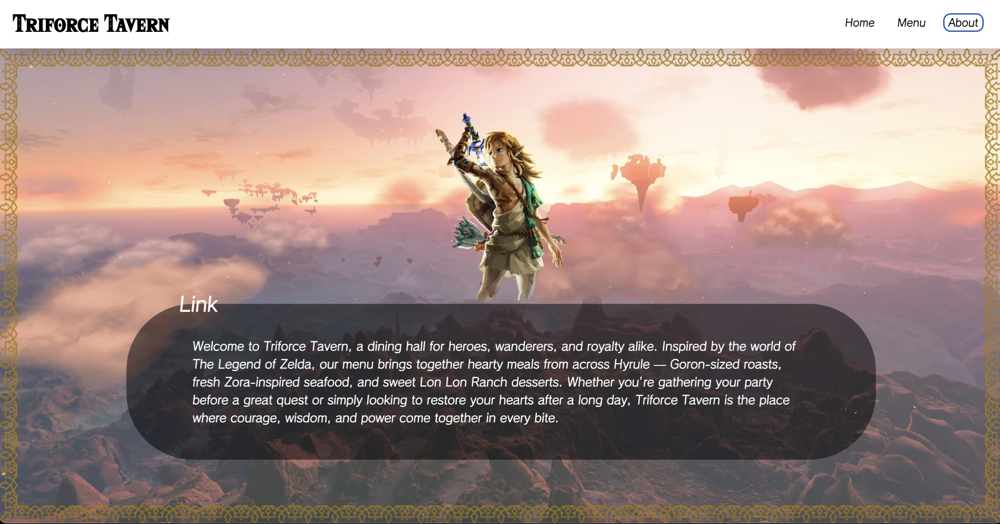

# 🏰 Triforce Tavern

*A Zelda: Tears of the Kingdom--themed restaurant webpage built with
Webpack and ES6 modules*



------------------------------------------------------------------------

## 🌟 Overview

**Triforce Tavern** is a hypothetical restaurant webpage set in the
world of *The Legend of Zelda: Tears of the Kingdom*. Imagine if Link
himself opened a cozy tavern east of Tarrey Town, serving iconic
Hyrulean dishes like Fragrant Seafood Stew and Hylian Tomato Pizza.

This project was created to demonstrate:\
- Modular JavaScript with **ES6 imports/exports**\
- Asset management and bundling using **Webpack**\
- Clean component-based structure for pages (`Home`, `Menu`, and
`About`)\
- Styling with custom fonts and animations inspired by the Zelda
universe

------------------------------------------------------------------------

## 📂 Project Structure

    src/
    │── assets/
    │   ├── fonts/             # Custom Zelda-inspired fonts
    │   ├── food/              # Images of dishes featured on the menu
    │   └── ...                # More Assets
    │
    │── about.css              # Styles for About page
    │── about.js               # About page component
    │── home.css               # Styles for Home page
    │── index.js               # Entry point – handles navigation and page switching
    │── menu.css               # Styles for Menu page
    │── menu.js                # Menu rendering + carousel logic
    │── styles.css             # Global styles, fonts, animations
    │── template.html          # Base HTML template

Webpack bundles everything into `dist/`, using `template.html` as the
HTML entry.

------------------------------------------------------------------------

## ✨ Features

-   **Dynamic Navigation**: Switch seamlessly between Home, Menu, and
    About pages.\
-   **Menu Carousel**: Browse dishes in a scrollable, looping menu with
    styled food cards.\
-   **Animated UI**: Smooth fade-in animations for content and
    background transitions.\
-   **Custom Fonts**: Authentic Zelda-inspired typefaces for headings
    and UI.\
-   **Reusable Components**: Home, Menu, and About sections are modular
    for maintainability.

------------------------------------------------------------------------

## 🚀 Getting Started

### 1. Clone the Repository

``` bash
git clone https://github.com/daanniill/restaurant-page.git
cd restaurant-page
```

### 2. Install Dependencies

``` bash
npm install
```

### 3. Run Development Server

``` bash
npm start
```

This will spin up Webpack's dev server and open the page in your
browser.

### 4. Build for Production

``` bash
npm run build
```

The optimized output will be generated in the `dist/` folder.

------------------------------------------------------------------------

## 📸 Screenshots





------------------------------------------------------------------------

## 🙏 Credits

-   **Developer**: [@daanniill](https://github.com/daanniill)\
-   **Game Assets & Screenshots**: © Nintendo (*The Legend of Zelda:
    Tears of the Kingdom*)

------------------------------------------------------------------------

## ⚖️ License

This project is intended for **educational and demonstration purposes
only**.\
Not for commercial use.
